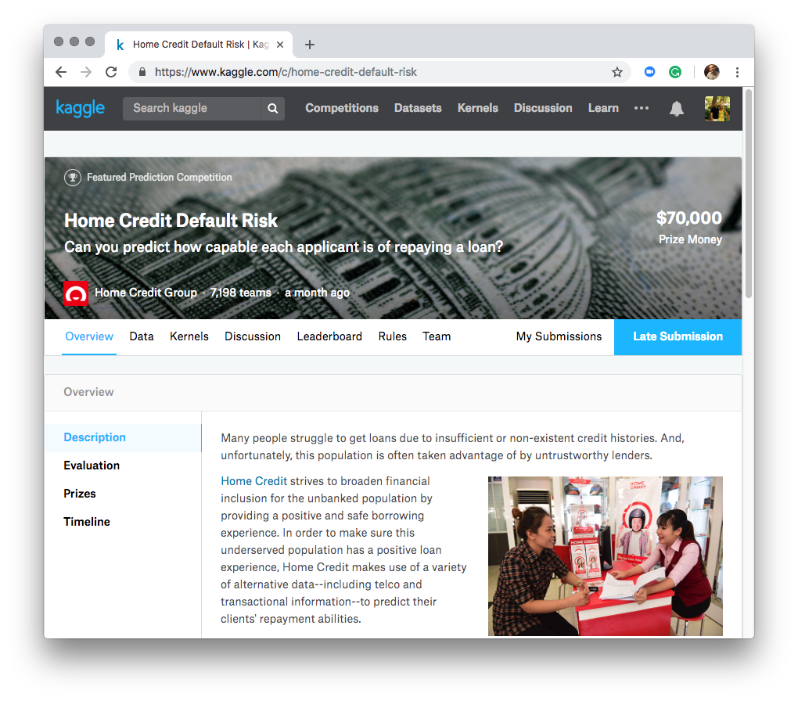
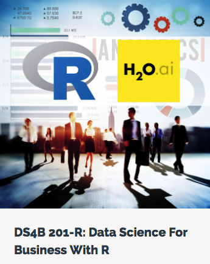
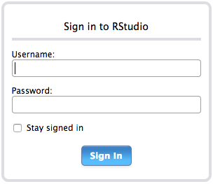

# DSGO 2018 Workshop - Business Science

___Get ready to learn how to predict credit defaults with `R` + `H2O`!___

## Program

<a href="https://www.kaggle.com/c/home-credit-default-risk">

</a>

- Data is Credit Loan Applications to a Bank. 

- Best Kagglers got 0.80 AUC with more 100's of manhours, feature engineering, combining more data sets 

- We'll get 0.75 AUC in 30 minutes of coding (+1.5 hour of explaining)


## Data

- Kaggle Competition: [Home Credit Default Risk](https://www.kaggle.com/c/home-credit-default-risk)

- Data is large (166MB unzipped, 308K rows, 122 columns)

- Will work with sampled data 20% to keep manageable


## Module 01 - H2O

The goal of Module 01 - H2O is to get you experience with:

1. The R programming language

2. `h2o` for machine learning

3. `lime` for feature explanation

4. `recipes` for preprocessing

### Becoming A Data Science Rockstar

<a href="https://university.business-science.io/p/hr201-using-machine-learning-h2o-lime-to-predict-employee-turnover/?product_id=635023&coupon_code=DSGO20">

</a>

- This 3 hour workshop will teach you some of the latest tools & techniques for Machine Learning in business

- With this said, you will spend 5% of your time on modeling (machine learning) & 95% of your time:

    - Managing projects
    - Collecting & working with data (manipulating, combining, cleaning) 
    - Visualizing information - showing the size of problems and what is likely contributing
    - Communicating results in terms the business cares about 
    - Recommending actions that improve the business

- Further, your organization will be keenly aware of what you contribute __financially__. You need to show them __Return on Investment (ROI)__. They are making an investment in having a data science team. They expect __tangible results__. 

- Important Actions:

    - Attend my talk on the [Business Science Problem Framework](https://www.business-science.io/bspf.html) tomorrow. The BSPF is the essential system that enables driving ROI with data science.
    
    - Take my [DS4B 201-R course](https://university.business-science.io/p/hr201-using-machine-learning-h2o-lime-to-predict-employee-turnover/?product_id=635023&coupon_code=DSGO20). This teaches you a 10-Week Program that has cut data science projects in half for consultants and has progressed data scientists more than any other course they've take. ___You will get 20% OFF (expires after DSGO conference).___


---

## Installation Instructions 

### Option 1: RStudio IDE Desktop + Install R Packages

###### Step 1: Install R and RStudio IDE

- [Download and Install R](https://cloud.r-project.org/)

- [Download RStudio IDE Desktop](https://www.rstudio.com/products/rstudio/download/)

###### Step 2: Open Rstudio and run the following scripts

```
pkgs <- c("h2o", "tidyverse", "rsample", "recipes")
install.packages(pkgs)
```

Test H2O - You may need the [Java Developer Kit](http://docs.h2o.ai/h2o/latest-stable/h2o-docs/welcome.html#requirements)

```
library(h2o)
h2o.init()
```

If H2O cannot connect, you probably need to install Java. 

###### Step 3: Load the Project From GitHub

_Wait for instructions from Matt._

The URL for the GitHub project is:

https://github.com/business-science/workshop_2018_dsgo

### Option 2: If You Have Docker Installed

###### Step 0: Docker Installation (Takes Time)

_Skip this step if you already have Docker Community Edition installed_

[Docker Community Edition Installation Instructions](https://store.docker.com/search?offering=community&type=edition)


###### Step 1: Run the DSGO Workshop Docker Image

In a terminal / command line, run the following command to download and install the workshop container. This will take a few minutes to load. 

```
docker run -d -p 8787:8787 -v "`pwd`":/home/rstudio/working -e PASSWORD=rstudio -e ROOT=TRUE mdancho/workshop_2018_dsgo
```

###### Step 3: Fire Up RStudio IDE in your Browser

Go into you favorite browser (I'll be using Chrome), and enter the following in the web address field.

```
localhost:8787
```

###### Step 4: Log into RStudio Server

<a href="https://www.kaggle.com/c/home-credit-default-risk">

</a>

Use the following credentials.

- __User Name:__ rstudio
- __Password:__ rstudio

<div class="clearfix"></div>


###### Step 5: Load the Project From GitHub

_Wait for instructions from Matt._

The URL for the GitHub project is:

https://github.com/business-science/workshop_2018_dsgo


---

## Further Resources

- `tidyverse`: A meta-package for data wrangling and visualization. Loads `dplyr`, `ggplot2`, and a number of essential packages for working with data. Documentation: https://www.tidyverse.org/

- `recipes`: A preprocessing package that includes many standard preprocessing steps. Documentation: https://tidymodels.github.io/recipes/ 

- `h2o`: A high-performance machine learning library that is scalable and is optimized for perfromance. Documentation: http://docs.h2o.ai/h2o/latest-stable/h2o-docs/index.html 

    - GLM: Elastic Net (Generalized Linear Regression with L1 + L2 Regularization)
    
    - GBM: Gradient Boosted Machines (Tree-Based + Boosting)
    
    - Random Forest: Tree Based + Bagging
    
    - Deep Learning: Neural Network
    
    - Automated Machine Learning: Stacked Ensemble, All Models and Best of Family

- `lime`: A package for explaining black-box models. LIME Tutorial: https://www.business-science.io/business/2018/06/25/lime-local-feature-interpretation.html 

